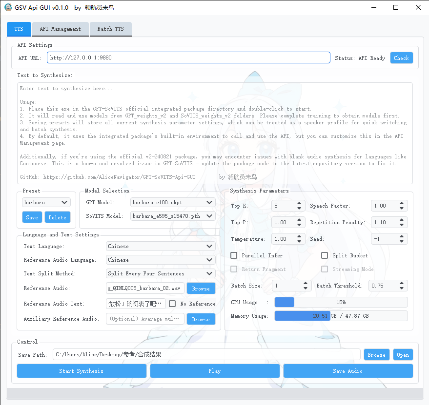
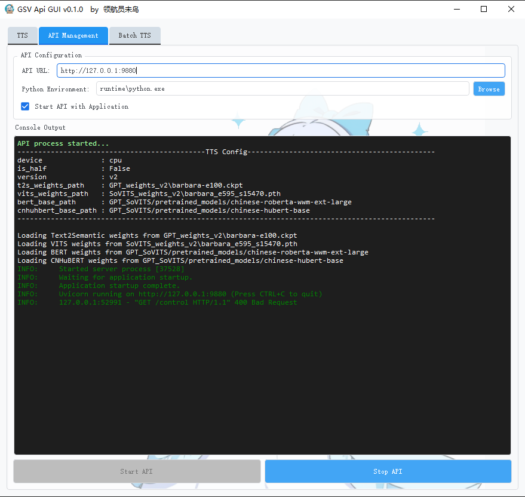
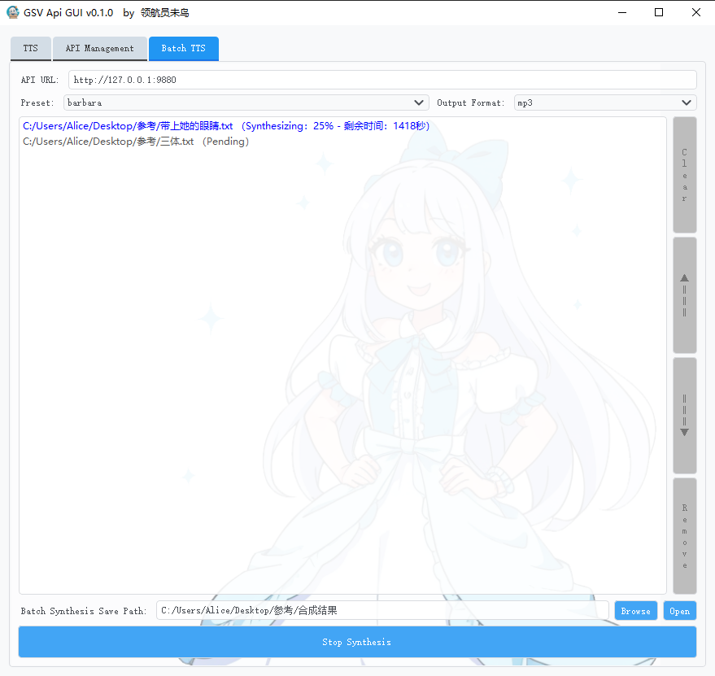

# GPT-SoVITS-Api-GUI

GAG is an inference GUI that can be directly used with the official GPT-SoVITS integration package. Simply place it into the integration package and run it to enjoy a more convenient inference experience.

## Introduction

<p float="left">
  
  
  
</p>

**注意： 如果你的系统语言为中文，那么界面语言应该会自动切换为中文，你也可以手动修改GAG_config.json中的language为en或zh来指定界面语言**


## Usage

You can download the latest release directly from [here](https://github.com/AliceNavigator/GPT-SoVITS-Api-GUI/releases/latest). Place this exe in the GPT-SoVITS official integrated package directory and double-click to start.

## Installation

1. Install FFmpeg and ensure it's in your system PATH.
2. Clone this repository:
   ```
   git clone https://github.com/AliceNavigator/GPT-SoVITS-Api-GUI.git
   ```
3. Install dependencies:
   ```
   pip install -r requirements.txt
   ```
4. Execute:
   ```
   python gsv_api_gui.py
   ```
